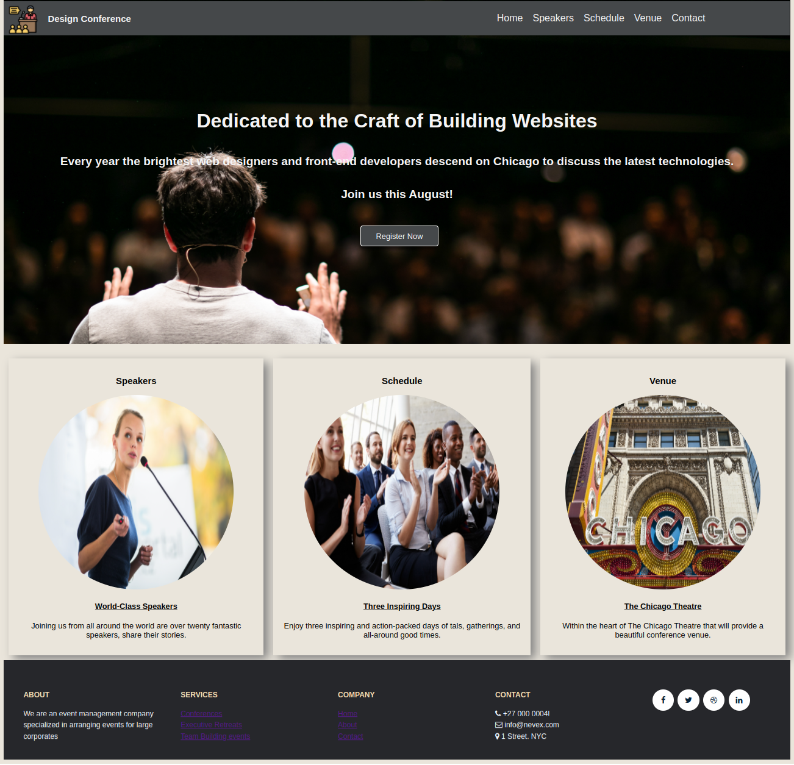
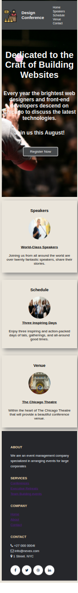

# Corporate Event Management

## Context

An event management company is building a website to highlight the corporate design conference that is about to happen. The website is managed by the event management company.

As a front end developer, you need to build a responsive website so that the users can use it on a mobile, laptop, or desktop device.​

## Problem Statement

Create a responsive web page which has multiple sections to display their various activities. The web page should resemble the image as shown below.

**Desktop View**

**Mobile View**

## Tasks
- The solution for this challenge can be developed in 4 stages:​
    - Stage 1 :: Header with a nav bar​
    - Stage 2 :: Single column Hero Unit which occupies full width ​
    - Stage 3 :: Main section with three columns​
    - Stage 4 :: Footer with social media links​
- The HTML code for the page design is provided in the index.html file.​
- The style properties should be defined in style.css located in the css folder of the boilerplate.​
- Use the flex layout for the header and main sections.​
- Use the grid layout for the footer.

### Using Flex and Grid Layout - Recommendations

- The layout for the header should be styled using the flex property.​
- All the menu items inside the fixed header must be links.​
- The hero unit should extend the entire width of the page and must have a background image, a header section with text content and a button.​
- The main section should have 3 cards that contain an image and text. Use flex layout to create this section.​
- The footer should use the grid layout which has a single row and 5 columns.​
- Use media queries to make the header, hero unit, main section and footer responsive.​

### Details

- Required images are available inside images folder.
- Color codes used in this web page are:
    - #45484a (Background-color for Header, Button )
    - whitesmoke (Heading, menu item, button text)
    - rgb(171, 171, 229) (Mouseover and underline color for menu items)
    - rgb(171, 171, 229) (Button background-color on mouse over)
    - #444 (Header text color of the Flex container that has cards)
    - rgb(234, 229, 219) (Card background color)
    - Grey (card box-shadow color)
    - Black (Anchor links inside the Flex container that has cards)
    - #26272b (Footer background-color)
    - #737373 (Footer Text color)
    - wheat (Footer headers)
    - aliceblue (Footer content)
    - #072339 (Socila media anchor link color)

- Font family used are:
    - "Gill Sans", "Gill Sans MT", Calibri, "Trebuchet MS", sans-serif (Headings and anchor in headers, buttons, Flex container having cards)
    - "Trebuchet MS", "Lucida Sans Unicode", "Lucida Grande", Arial, sans-serif (Headings in hero unit,footer)

